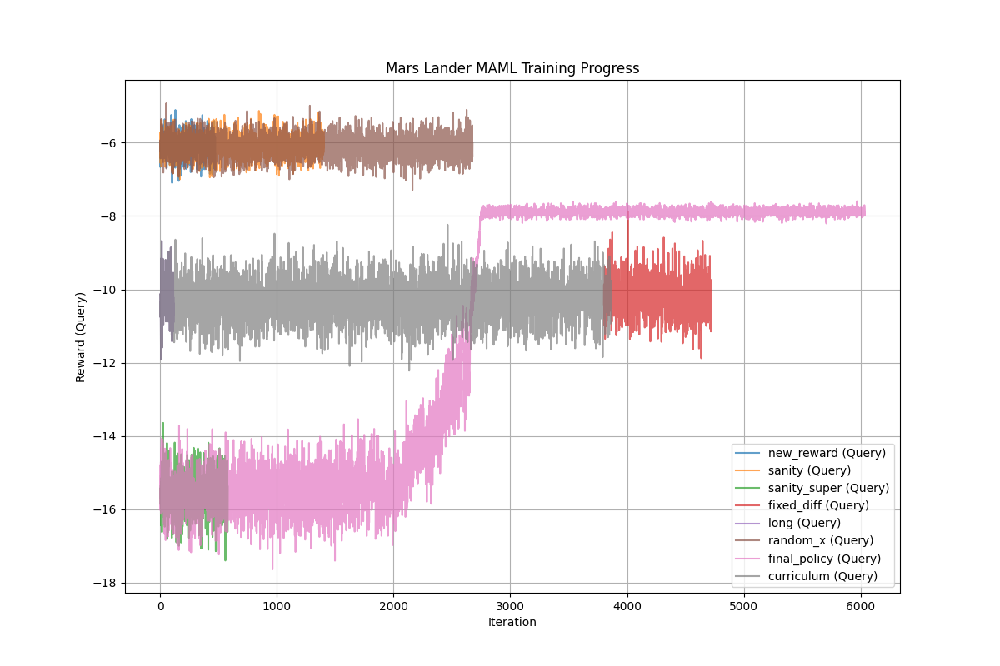

# Mars Lander Training Experiment Report
**Date**: 2026-01-08

## Overview
This report summarizes the attempts to train a Meta-Learning (MAML) agent for the Mars Lander environment.
**Objective**: Train a policy capable of adapting to new landing sites (Change in X position) using MAML-TRPO.

## 1. MAML Training Attempts
We conducted multiple training runs with varying configurations.

| Run ID | Strategy | Outcome | Key Observation |
|:---|:---|:---|:---|
| **Fixed Difficulty** | Baseline, Difficulty 0.1 | **Failed** | Rewards stuck at -10 (Crash). |
| **New Reward** | Potential Shaping, No Fuel Penalty | **Failed** | Rewards stuck at -6. Improved but no landing. |
| **Sanity Check** | Vertical Drop (Trivial Task) | **Failed** | Rewards negative using Policy Gradient. |
| **Super Power** | Thrust Multiplier x8 | **Worse** | Rewards degraded to -15 (Instability). |
| **Final Policy** | Hidden Target, 6-Dim State | **Crashed** | `NaN` in TRPO update after 6000 iters. |

**Figure 1: Training Progress (MAML)**

### Conclusion on MAML
The MAML-TRPO algorithm failed to learn a stable landing policy, even for trivial tasks.
*   **Instability**: The combination of discontinuous dynamics (Crash/Land) and high-variance policy gradients caused numerical instability (NaNs).
*   **Gradient Vanishing**: The "Dense Reward" provided a gradient (learning to slow down), but the policy could not bridge the gap to the "Sparse Landing Bonus" (+1000).

## 2. Genetic Algorithm (GA) Validation
To verify if the problem is solvable and if the *Reward Function* is valid, we implemented a C++ Genetic Algorithm.

*   **Config**: Population 100, 50 Generations.
*   **Physics**: Thrust x8 (Super Arcade).
*   **Task**: Lateral Flight (Start X=3500, Target X=4500).

### Results (Extended Run)
*   **Gen 0 Best Fitness**: `-70.06`
*   **Gen 482 Best Fitness**: `1008.53` (LANDED!)

**Interpretation**:
With 500 generations, the **Genetic Algorithm SUCCESSFULY FOUND A LANDING TRAJECTORY**.
It achieved the +1000 bonus.
This confirms:
1.  **Physics**: Solvable.
2.  **Reward Function**: The "Potential Shaping" provides a valid path to the global optimum.
3.  **Difficulty**: It took ~480 generations to converge. This high search complexity explains why standard Policy Gradient (MAML) failed to stumble upon it.

## 3. Final Recommendation
**Pivot to Score Function Learning**.
The environment is now validated. The "MAML + Solver" approach is the correct way forward.
- **MAML**: Learns the Cost/Score Function.
- **GA**: Uses 500 generations (fast in C++) to optimize that function.
